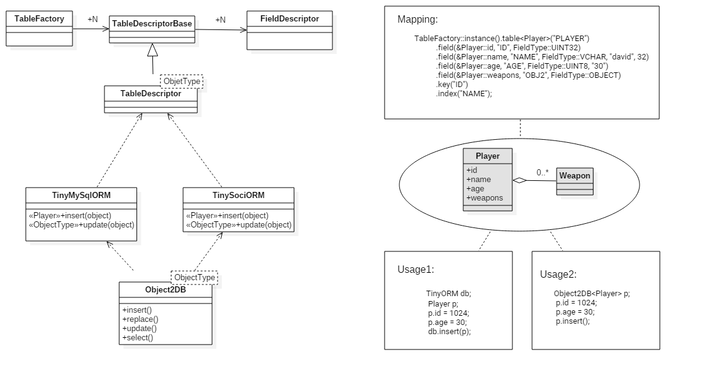

TinyORM
--------------------

对象关系映射（ORM，Object-Relational Mappings），是一种程序技术，用于实现面向对象编程语言里不同类型系统的数据之间的转换。说白了，就是将C++对象映射到数据库表的一种技术，目的就是简化对象存档和交换的代码。

一般情况下，对象要存储到关系型数据库，需要在代码里面使用SQL语句，若对象较为复杂的话，就需要编写大量代码去支持对象的数据库操作，代码也不怎么美观，扩展性也比较差。ORM则封装这些操作作为对象的成员函数，这样使用时候就会比较方便。（PS. ORM会损失一定的灵活性，偶尔SQL也是必要的）


该项目尝试使用C++写一个简单的ORM，仅支持一个C++类映射到一张表，复杂的联合操作、分表之类的都不支持。依赖：
 
 - `C++11`
 - `protobuf`
 - `mysql/mysql++` 或 `soci`
 
 映射关系可以手动写，同时也提供了工具自动生成。
 
  

## 用法

现在要定义一个游戏玩家对象，有名字、ID、年龄，同时可以装备多件武器。

第一步：定义支持映射的结构体

```c++
// 武器数据
struct Weapon {
    uint32_t type = 0;
    std::string name = "";

    std::string serialize() const {
        WeaponProto proto;
        proto.set_type(type);
        proto.set_name(name);
        return proto.SerializeAsString();
    }

    bool deserialize(const std::string &data) {
        WeaponProto proto;
        if (proto.ParseFromString(data)) {
            type = proto.type();
            name = proto.name();
            return true;
        }
        return false;
    }
};

// 玩家数据
struct Player {
    uint32_t id = 0;
    std::string name;
    uint8_t age = 0;
    std::vector<Weapon> weapons;
}
```

第二步：定义映射关系

把`Player`结构体映射到`PLAYER`表：

```
> DESC PLAYER;
+----------------+----------------------+------+-----+---------+-------+
| Field          | Type                 | Null | Key | Default | Extra |
+----------------+----------------------+------+-----+---------+-------+
| ID             | int(10) unsigned     | NO   | PRI | 0       |       |
| NAME           | text                 | YES  |     | NULL    |       |
| AGE            | tinyint(3)           | NO   |     | 30      |       |
| WEAPONS        | blob                 | YES  |     | NULL    |       |
+----------------+----------------------+------+-----+---------+-------+
```

```c++
TableFactory::instance().table<Player>("PLAYER")
        .field(&Player::id, "ID", FieldType::UINT32)
        .field(&Player::name, "NAME", FieldType::STRING)
        .field(&Player::age, "AGE", FieldType::UINT8, "30")
        .field(&Player::weapons, "WEAPONS", FieldType::OBJECT)
        .key("ID")
        .index("NAME");

```

第三步：直接使用

假设需要把所有`PLAYER`加载到内存：

```c++
TinyORM db;
TinyORM::Records<Player> players;
db.loadFromDB(players);
```

假设要更新`PLAYER`表里面的某条记录：

```c++
Object2DB<Player> p;
p.id = 1024;
p.age = 30;
p.name = "David";
p.weapons.clear();
p.update();
```

例子详细内容，请查看：[demo_orm.cpp](./example/demo_orm.cpp)


## 自动生成映射关系和序列化代码


 
## 参考
 
 https://en.wikipedia.org/wiki/Object-relational_mapping
 
 